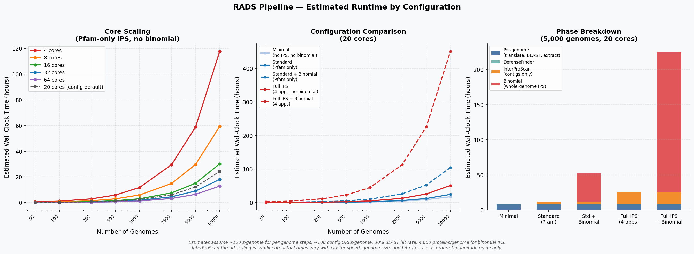

# Advanced Usage

This guide covers advanced features and customization options for RADS.

## Running Specific Pipeline Steps

### Target Specific Outputs

```bash
# Run only up to BLAST
pixi run snakemake results/{sample}/blast_results/master_blast.txt --cores 8

# Run only DefenseFinder
pixi run snakemake results/{sample}/defensefinder/defense_finder_systems.tsv --cores 4

# Run multiple specific targets
pixi run snakemake \
    results/{sample}/blast_results/master_blast.txt \
    results/{sample}/cotranscription/cotranscribed_sequences.faa \
    --cores 8
```

### Skip Specific Steps

```yaml
# Disable optional components in config/config.yaml
interproscan:
  enabled: false

defensefinder:
  enabled: false
```

### Force Re-run Specific Rules

```bash
# Re-run a specific rule and all downstream
pixi run snakemake --forcerun blast_search --cores 8

# Re-run everything
pixi run snakemake --forceall --cores 8
```

## Working with Multiple Samples

### Batch Processing

Create a script to run multiple samples:

```bash
#!/bin/bash
# run_all_samples.sh

samples=("sample1" "sample2" "sample3")

for sample in "${samples[@]}"; do
    echo "Processing $sample..."
    pixi run snakemake \
        --configfile config/${sample}_config.yaml \
        --cores 8 \
        || echo "Failed: $sample"
done
```

### Parallel Sample Processing

```bash
# Using GNU parallel
parallel -j 2 'pixi run snakemake \
    --configfile config/{}_config.yaml --cores 4' ::: sample1 sample2 sample3
```

### Comparing Results Across Samples

```python
# compare_samples.py
import polars as pl
from pathlib import Path

samples = ["sample1", "sample2", "sample3"]
all_results = []

for sample in samples:
    blast_file = Path(f"results/{sample}/blast_results/master_blast.txt")
    if blast_file.exists():
        df = pl.read_csv(blast_file, separator="\t")
        df = df.with_columns(pl.lit(sample).alias("sample"))
        all_results.append(df)

combined = pl.concat(all_results)
print(combined.group_by("sample").len())
```

## Custom Query Sequences

### Multiple Query Proteins

The pipeline supports multi-FASTA queries:

```fasta
>protein1
MKTQPIKVN...
>protein2
MLIVGQRPK...
>protein3
MSDFTYHNK...
```

### Query from GenBank

```bash
# Download protein sequence from NCBI
pixi run efetch -db protein -id "WP_123456789.1" -format fasta > resources/my_query.fa
```

### Query Preprocessing

```bash
# Remove problematic characters
pixi run seqkit seq -w 0 resources/raw_query.fa > resources/clean_query.fa
```

## Customizing BLAST Parameters

### E-value Threshold

Edit `workflow/rules/blast_search.smk`:

```python
rule blast_search:
    shell:
        """
        diamond blastp \
            -d {input.db} \
            -q {params.query} \
            --evalue 1e-10 \  # Add e-value threshold
            ...
        """
```

### Additional Output Columns

```python
# Add more BLAST output columns
-outfmt "6 qseqid sseqid length nident pident evalue bitscore qcovhsp"
```

### Use BLASTp Instead of Diamond

For more sensitive searches:

```python
rule blast_search:
    conda:
        "../envs/blast.yaml"
    shell:
        """
        blastp \
            -db {input.db} \
            -query {params.query} \
            -outfmt "6 qseqid sseqid length nident pident evalue" \
            -num_threads {threads} \
            -out {output}
        """
```

## Customizing Flanking Region Extraction

### Asymmetric Flanking Regions

```yaml
# config/config.yaml
upstream_nt: 10000    # More upstream
downstream_nt: 3000   # Less downstream
```

### Variable Flanking by Hit

Modify `workflow/rules/extract_contigs.smk` to use different flanking sizes based on hit properties.

### Include Hit Sequence in Output

By default, flanking regions include the hit. To exclude:

```python
# In extract_contigs.smk, modify coordinate calculation:
start = max(0, hit_start - upstream_nt)  # Start before hit
end = min(genome_len, hit_end + downstream_nt)  # End after hit
```

## Custom Annotations

### Adding New Annotation Tools

Create a new rule file `workflow/rules/my_annotation.smk`:

```python
rule run_my_tool:
    input:
        proteins = f"results/{SAMPLE}/contig_orfs/all_contigs.faa"
    output:
        results = f"results/{SAMPLE}/my_annotation/results.tsv"
    log:
        f"logs/{SAMPLE}/my_annotation.log"
    shell:
        """
        my_tool -i {input.proteins} -o {output.results} 2>&1 | tee {log}
        """
```

Add to Snakefile:
```python
include: "workflow/rules/my_annotation.smk"

rule all:
    input:
        ...
        f"results/{SAMPLE}/my_annotation/results.tsv",
```

### Custom Domain Database

```python
rule custom_hmmscan:
    input:
        proteins = f"results/{SAMPLE}/contig_orfs/all_contigs.faa",
        db = "resources/my_custom.hmm"
    output:
        f"results/{SAMPLE}/custom_hmmscan/results.txt"
    shell:
        """
        hmmscan --tblout {output} {input.db} {input.proteins}
        """
```

## Cluster/HPC Execution (SLURM)

RADS ships with a ready-to-use SLURM profile at `profiles/slurm/`. It uses the
Snakemake 8 native SLURM executor (`snakemake-executor-plugin-slurm`, already
included in the pixi dependencies) to submit each rule as an independent batch
job, allowing hundreds of genomes to be processed in parallel.

### Quick Start

```bash
# 1. Install the pixi environment on the login node (one time)
pixi install

# 2. Submit the pipeline
pixi run slurm
```

`pixi run slurm` expands to:
```bash
mkdir -p logs/slurm && snakemake --profile profiles/slurm
```

Snakemake stays running on the login node as the orchestrator; all compute
happens on cluster nodes via `sbatch`.

### Installing Pixi on HPC

Most HPC systems do not ship pixi. Install it to your home directory (which is
on the shared filesystem and therefore visible from all nodes):

```bash
curl -fsSL https://pixi.sh/install.sh | bash
# Follow the prompt to add ~/.pixi/bin to your PATH in ~/.bashrc
source ~/.bashrc
```

Verify pixi is available on a compute node:
```bash
srun --pty bash -c "which pixi"
```

If your cluster does not source `~/.bashrc` for batch jobs (some do not), you
have two options:

**Option A — rely on `--export=ALL` (default for the RADS profile)**

The profile sets `slurm_extra="--export=ALL"`, which instructs SLURM to copy
the full login-node environment—including `PATH`—into every job. This is the
simplest approach and works on most clusters.

**Option B — add an explicit PATH to the profile**

If `--export=ALL` is blocked by your cluster policy, open
`profiles/slurm/config.yaml` and replace the `slurm_extra` line:

```yaml
default-resources:
  - slurm_extra="--export=NONE --export=PATH=/home/YOUR_USER/.pixi/bin:$PATH"
```

> The `run_defensefinder` rule calls `pixi run -e defensefinder ...` directly.
> If pixi is not on PATH on compute nodes, that rule will fail. Confirming pixi
> availability with `srun` (above) before a full run saves debugging time.

### Cluster-Specific Settings

Open `profiles/slurm/config.yaml` and adjust the `default-resources` block for
your cluster before running:

```yaml
default-resources:
  - mem_mb=4000
  - runtime=60
  - slurm_extra="--export=ALL"
  # Uncomment and set these if your cluster requires them:
  # - slurm_partition=compute
  # - slurm_account=your_account
```

To target a specific partition for all jobs:
```yaml
  - slurm_partition=high_mem
```

To override resources for a single rule (e.g., give InterProScan more time):
```yaml
set-resources:
  run_interproscan:
    mem_mb: 64000
    runtime: 960
```

### What Gets Parallelized

| Rule | Parallelism |
|---|---|
| `translate_genome` | One job per genome (hundreds in parallel) |
| `build_database` | One job per genome |
| `blast_search` | One job per genome — 8 CPUs, 16 GB each |
| `extract_orf_ids`, `extract_coordinates`, `create_bed_file`, `extract_contig_sequences` | One job per genome |
| `run_interproscan` | Single job, 8 CPUs, 32 GB |
| `run_defensefinder` | Single job, 8 CPUs, 16 GB |
| `run_interproscan_chunk` *(binomial)* | **One job per ~50k-protein chunk** (see below) |

Per-genome rules scale linearly with your genome count and are all submitted
simultaneously (up to the `jobs: 100` cap). For a 500-genome run the pipeline
takes roughly as long as a single-genome run for those steps.

### Binomial Analysis: Parallel InterProScan

When `binomial.enabled: true` and no pre-computed `whole_genome_interproscan`
path is given, RADS splits the combined whole-genome protein file into chunks
and runs each chunk as its own SLURM job:

```
genomes_with_hits_cleaned.faa
        │
        ▼  split_proteins_for_binomial (checkpoint)
        │  seqkit split2 --by-size 50000
        │
   ┌────┴──────────────────────────────────┐
   │  chunk_001.faa  chunk_002.faa  ...     │  ← one SLURM job each
   └────┬──────────────────────────────────┘
        │  run_interproscan_chunk (scatter)
        │  InterProScan -cpu 8 per chunk
        ▼
   aggregate_interproscan_chunks (gather)
        │  cat all TSVs → interproscan_wholegenomes.tsv
        ▼
   run_binomial_analysis
```

The chunk size is configurable in `config/config.yaml`:

```yaml
binomial:
  interproscan_chunk_size: 50000  # proteins per SLURM job
```

Reduce the chunk size to create more (shorter) parallel jobs; increase it if
you have very few genomes and want fewer jobs. At 50,000 proteins/chunk a
typical run of 100 bacterial genomes (~400k proteins) produces ~8 parallel
InterProScan jobs instead of one serial job.

To skip this step entirely and provide your own pre-computed file:

```yaml
binomial:
  whole_genome_interproscan: "/path/to/my_precomputed_ips.tsv"
```

### Monitoring Jobs

```bash
# Watch job queue
watch squeue -u $USER

# Check Snakemake log (runs in foreground on login node)
# Snakemake prints job IDs as they are submitted

# Per-job stdout/stderr
ls logs/slurm/
# Files are named by SLURM job ID: slurm-<jobid>.out

# Per-rule logs (always written regardless of cluster mode)
ls logs/{sample_name}/
```

### Resuming After Failure

Snakemake tracks completed outputs. If jobs fail or the session is interrupted,
simply re-run:

```bash
pixi run slurm
```

Snakemake will skip finished steps and resubmit only what is missing or
incomplete. Add `--rerun-incomplete` if any partial output files exist:

```bash
mkdir -p logs/slurm && snakemake --profile profiles/slurm --rerun-incomplete
```

### Dry Run

Preview exactly which jobs will be submitted without actually submitting:

```bash
pixi run dry-run
# or, to see SLURM resource annotations:
snakemake --profile profiles/slurm -n
```

### Adjusting Concurrency

The default cap is 100 simultaneous jobs. Change `jobs:` in
`profiles/slurm/config.yaml` to match your cluster's fair-use policy:

```yaml
jobs: 50   # conservative
jobs: 200  # if your allocation allows
```

### InterProScan on HPC

InterProScan is not managed by pixi — it requires a separate manual
installation (see [Installation](Installation.md)). On HPC, the path set in
`config/config.yaml` must be accessible from compute nodes:

```yaml
interproscan:
  path: "/scratch/shared/interproscan-5.76-107.0/interproscan.sh"
```

Use a path on the shared filesystem (not local scratch) so all nodes can reach
it.

## Workflow Visualization

### Generate DAG

```bash
# Full DAG
pixi run snakemake --dag | dot -Tsvg > dag.svg

# Simplified rulegraph
pixi run snakemake --rulegraph | dot -Tpng > rulegraph.png

# File graph
pixi run snakemake --filegraph | dot -Tpdf > filegraph.pdf
```

### Generate Report

```bash
pixi run snakemake --report report.html
```

## Performance Tuning

### Runtime Estimates

The figure below shows estimated wall-clock times as a function of genome count, core count, and pipeline configuration. Estimates assume ~120 s/genome for per-genome steps (translate, BLAST, extract), ~100 contig ORFs/genome, a 30% BLAST hit rate, and ~4,000 proteins/genome for the binomial whole-genome InterProScan.



Key takeaways:
- **InterProScan dominates runtime** at scale — using Pfam-only (`applications: "Pfam"`) instead of multiple databases can reduce IPS time by 5–10×.
- **Binomial analysis adds substantial cost** because it runs InterProScan on whole-genome proteomes of all genomes with BLAST hits. Provide a precomputed `whole_genome_interproscan` TSV to skip this step.
- **Core scaling has diminishing returns** above ~16–32 cores because InterProScan and DefenseFinder are largely sequential.
- **Limiting genomes** with `max_genomes` is the fastest way to reduce runtime for exploratory runs.

The generation script is at `docs/generate_performance_estimate.py` and can be re-run to update the figure if timing assumptions change.

### Resource Allocation

Add resources to rules:

```python
rule translate_genome:
    resources:
        mem_mb=4000,
        runtime=30
    threads: 2
```

### Caching

Enable between-workflow caching:

```bash
pixi run snakemake --cache --cores 8
```

### Benchmarking

Add benchmarks to track performance:

```python
rule blast_search:
    benchmark:
        "benchmarks/{sample}/blast_search.txt"
```

## Integration with Other Tools

### Export to Galaxy

```bash
# Create Galaxy-compatible output structure
mkdir -p galaxy_export
cp results/{sample}/blast_results/master_blast.txt galaxy_export/
cp results/{sample}/contig_orfs/all_contigs.faa galaxy_export/
```

### Export to Anvi'o

```bash
# Convert to Anvi'o-compatible format
pixi run python scripts/export_anvio.py results/{sample}
```

### Integration with Nextflow

For Nextflow compatibility, outputs follow standard naming conventions that can be imported into Nextflow workflows.

## Extending the Dashboard

### Add Custom Tab

In `dashboard/app.py`:

```python
# Add to app_ui navset_card_tab:
ui.nav_panel(
    "My Analysis",
    ui.card(
        ui.card_header("Custom Visualization"),
        ui.output_ui("my_custom_viz"),
    ),
),

# Add to server function:
@render.ui
def my_custom_viz():
    # Load your data
    df = load_my_data(results_dir())
    if df is None:
        return ui.p("No data")

    # Create visualization
    fig = px.bar(df.to_pandas(), x="category", y="count")
    return ui.HTML(fig.to_html(include_plotlyjs="cdn", full_html=False))
```

### Add Custom Data Loader

In `dashboard/utils/data_loader.py`:

```python
def load_my_data(results_dir: str) -> Optional[pl.DataFrame]:
    """Load custom analysis results."""
    file_path = Path(results_dir) / "my_analysis" / "results.tsv"
    if not file_path.exists():
        return None

    return pl.read_csv(file_path, separator="\t")
```

## Development and Testing

### Run Tests

```bash
# Use test configuration
pixi run snakemake --configfile config/test.yaml --cores 4

# Dry run to check syntax
pixi run snakemake -n
```

### Lint Snakefiles

```bash
pixi run snakefmt workflow/rules/
pixi run snakefmt Snakefile
```

### Debug Mode

```bash
# Maximum verbosity
pixi run snakemake --cores 4 -p --verbose --debug-dag

# Print shell commands
pixi run snakemake --cores 4 --printshellcmds
```

## Next Steps

- [[Pipeline-Overview]] - Understanding the pipeline
- [[Troubleshooting]] - Solving common issues
- [Snakemake Documentation](https://snakemake.readthedocs.io/) - Official Snakemake docs
